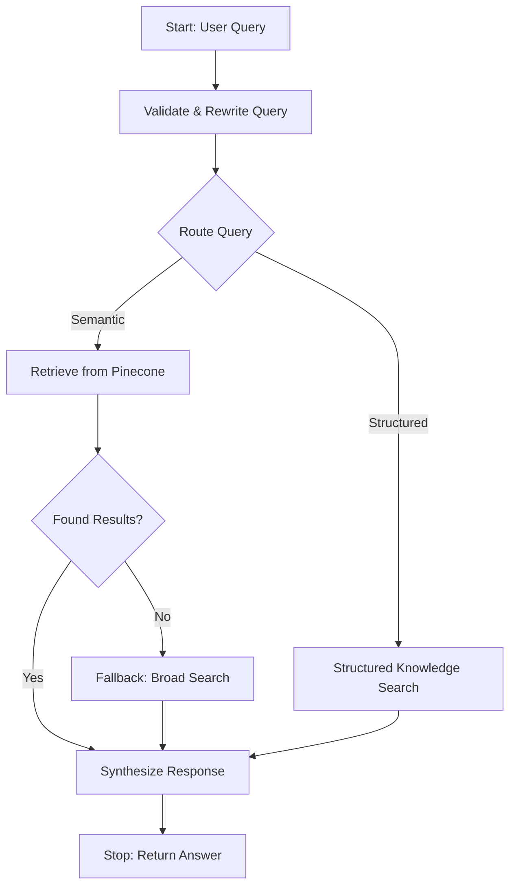

# Agentic RAG Observer 🚀

An advanced event-driven Agentic RAG system designed to analyze, query, and extract insights from technical documentation and development decisions captured by AI coding tools (e.g., Cursor, Claude Code).

This project demonstrates production-grade AI Agent capabilities, including complex workflows, long-term memory (Vector DB), and structured knowledge extraction.

---

## 🛠️ Core Technology Stack
- **Framework:** [LlamaIndex](https://www.llamaindex.ai/) (Workflows, Ingestion Pipeline)
- **LLM:** [Cohere](https://cohere.com/) (Command-R, Multilingual Embeddings)
- **Vector Database:** [Pinecone](https://www.pinecone.io/) (Serverless)
- **UI:** [Gradio](https://www.gradio.app/)
- **Data:** JSON-based structured knowledge extraction using Pydantic schemas.

---

## 🌟 Key Features
- **Autonomous Doc Processor:** Automatically scans and processes Markdown files from various development environments.
- **Agentic Query Routing:** Dynamically classifies queries into **Semantic** (conceptual/explanations) or **Structured** (lists/rules/decisions) paths.
- **Context-Aware Query Rewriting:** Utilizes conversation history to reformulate follow-up questions into standalone, clear queries.
- **Hybrid Retrieval:** Combines semantic search from Pinecone with precise extraction from a pre-processed structured JSON knowledge base.
- **Intelligent Fallback:** Automatically triggers a broader search if the initial retrieval doesn't meet the quality threshold.

---

## 🏗️ Workflow Architecture
The system operates on an event-driven architecture. Below is the agent's decision-making flow:



---

## 🚀 Getting Started

### 1. Prerequisites
- Python 3.10+
- API Keys for:
  - [Cohere](https://dashboard.cohere.com/)
  - [Pinecone](https://www.pinecone.io/)

### 2. Installation
Clone the repository and install dependencies:
```bash
git clone <repository-url>
cd rag-agent-project
pip install -r requirements.txt
```

### 3. Environment Setup
Create a `.env` file in the root directory:
```env
COHERE_API_KEY=your_cohere_key
PINECONE_API_KEY=your_pinecone_key
```

### 4. Running the Application
You can run the Jupyter Notebook or launch the Gradio interface directly:
```bash
python RAG_MVP_Step1.py
```

---

## ❓ Example Queries
The agent is optimized to handle complex queries, retrieving English context and responding in the user's preferred language (e.g., Hebrew):

1. **Structured Queries:**
   - "Show me all technical decisions made last week regarding the database."
   - "List all UI rules defined for the project."
   - "Are there any high-severity performance warnings?"

2. **Semantic/Conceptual Queries:**
   - "How do the AI tools help manage memory in this project?"
   - "What is the team's strategy for adding new features?"
   - "Explain why an event-driven workflow was chosen."

3. **Contextual Follow-ups:**
   - User: "What does the documentation say about Pinecone?"
   - User: "And how is it implemented in our project?" (Agent understands "it" refers to Pinecone).

---

## 📁 Project Structure
- `RAG_MVP_Step1.ipynb`: Core logic - Workflow definition and Ingestion pipeline.
- `extracted_knowledge.json`: The structured knowledge base extracted by the LLM.
- `meta-observer-target/`: Source directory containing Markdown files for analysis.

---

**Developed by Pessi Heineman as part of the AI Agents Specialization.**

